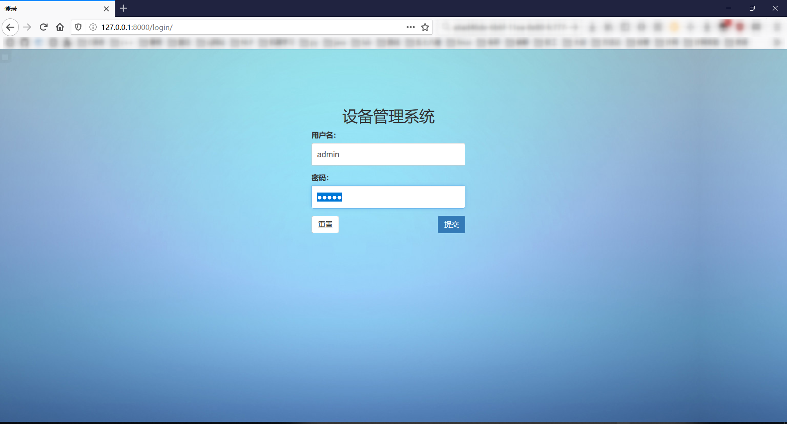
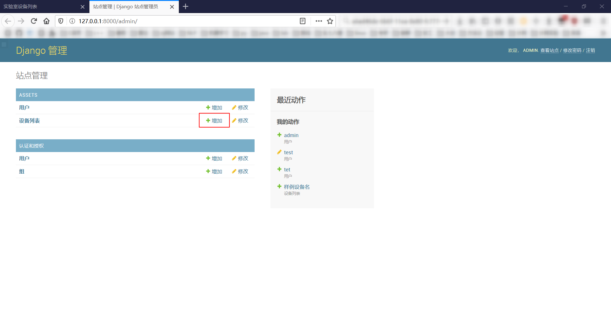
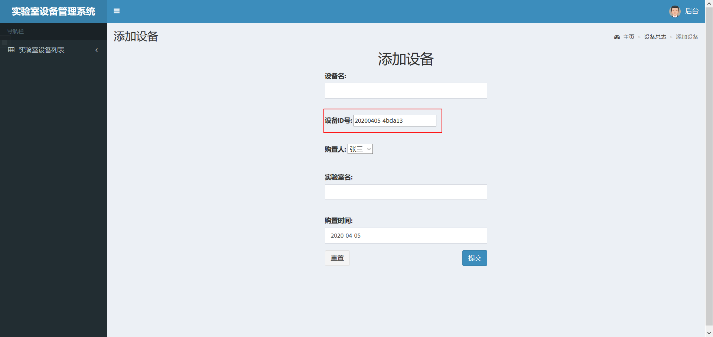
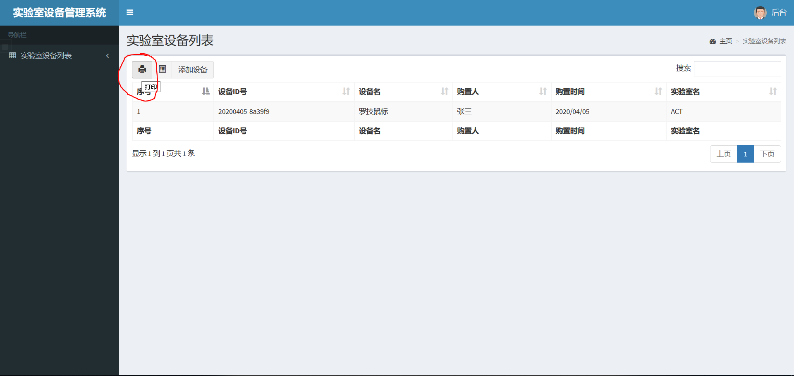
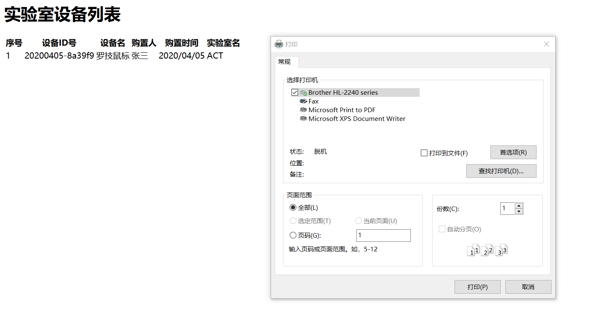
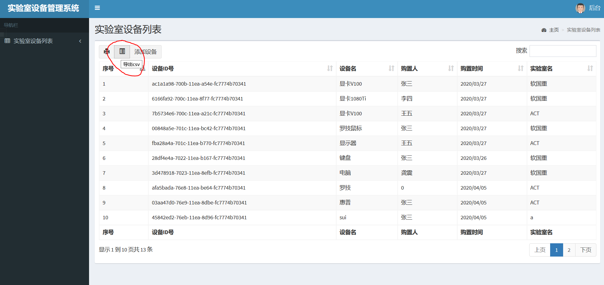
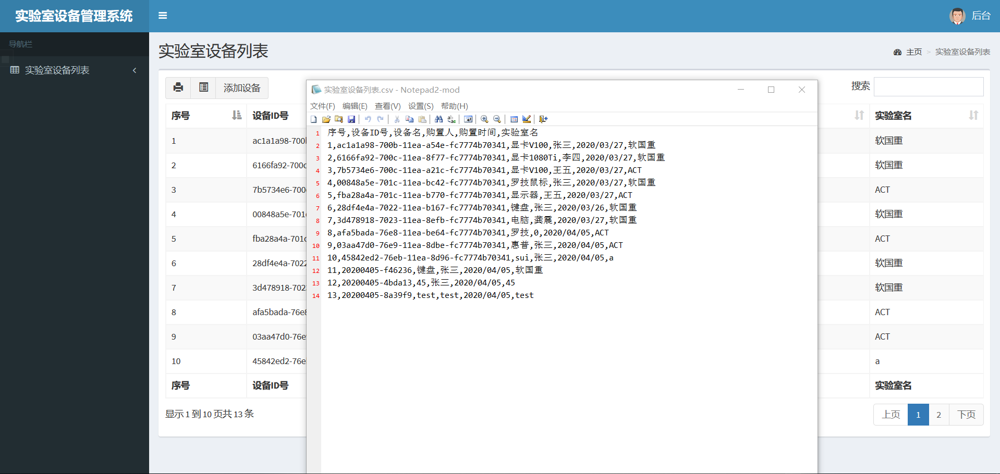

本项目分为登录界面、前台和后台三部分。登陆界面输入用户名密码后立即跳转到实验室设备列表的前台页面，前台页面展示了所有设备信息，在前台页面可以添加设备、进入后台。进入后台后也可以添加设备。

# 系统部署说明

首先需要安装anaconda环境。

在ManageSystemFinal目录下运行以下命令

```
conda create -n mysite python=3.7
conda activate mysite
pip install django==2.1.5
python manage.py runserver
```

打开浏览器进入http://127.0.0.1:8000

预置管理员账号：admin，密码：admin

(只能使用上述django版本，其余版本可能报错)

# 作业功能要点的操作说明

## 登录

进入http://127.0.0.1:8000或http://127.0.0.1:8000/login/ 登录

预置管理员账号：admin，密码：admin



## 查看设备列表

登录后会自动跳转

还可以进入http://127.0.0.1:8000/assets/index/ 查看设备列表

## 增加设备

- 如下图红框所示，点击添加设备按钮即可添加

  

- 可以在后台（进入http://127.0.0.1:8000/admin或点击右上角的“后台”按钮）中添加设备(下图红框处)

  

# 上周展示后修改和优化说明

## 修改“添加设备”按钮位置

将“添加设备”按钮独立出来，而之前是只在与设备一行的位置。


## 添加下拉选择框


## 优化设备id的设置

日期与随机数拼接在一起构成设备id，日期为设备ID提供了语义信息，6位十六进制随机数保证了不重复。



## 其他优化

### 添加打印功能

考虑到实验室报备审批需求，添加了打印功能便于提交纸质报表。

(点击下图红圈中的按钮)





### 添加导出csv功能

考虑到财务报表处理问题添加导出csv功能。



导出结果如下：



# 其他作业要求的说明

## 加密

密码采用Django框架的默认加密机制：pbkdf2_sha256

参考：https://docs.djangoproject.com/en/3.0/topics/auth/passwords/

# 系统环境

测试过的系统环境：Windows 10 Enterprise LTSC

浏览器：Firefox，Cent browser

Anaconda版本：miniconda 4.8.2

python版本：3.7

Django版本：2.1.5

（都是跨平台的技术，应该问题不大）

